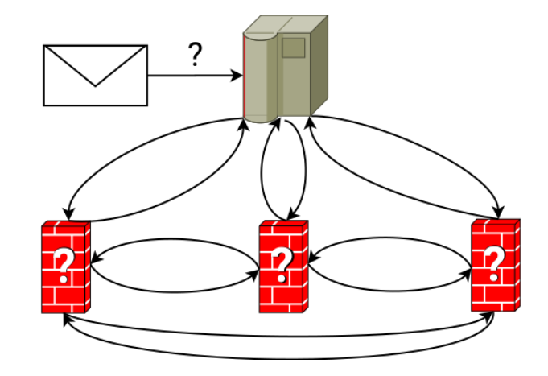
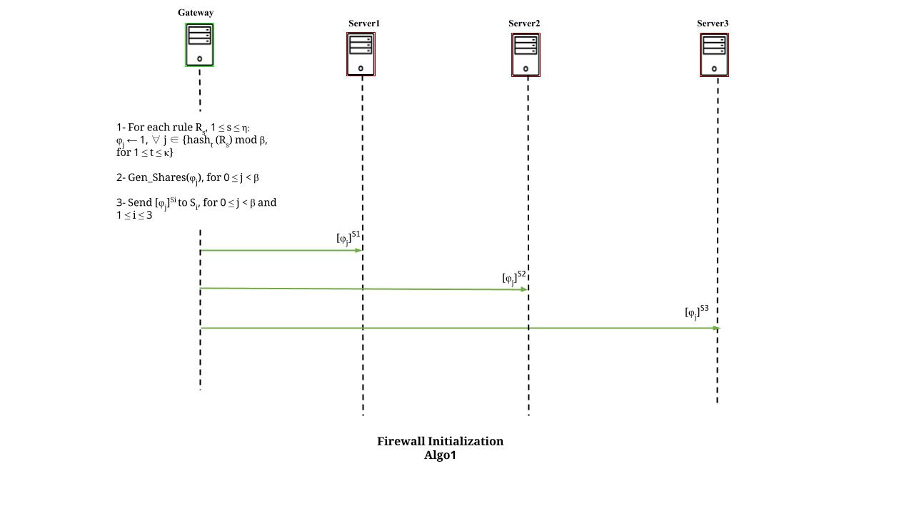
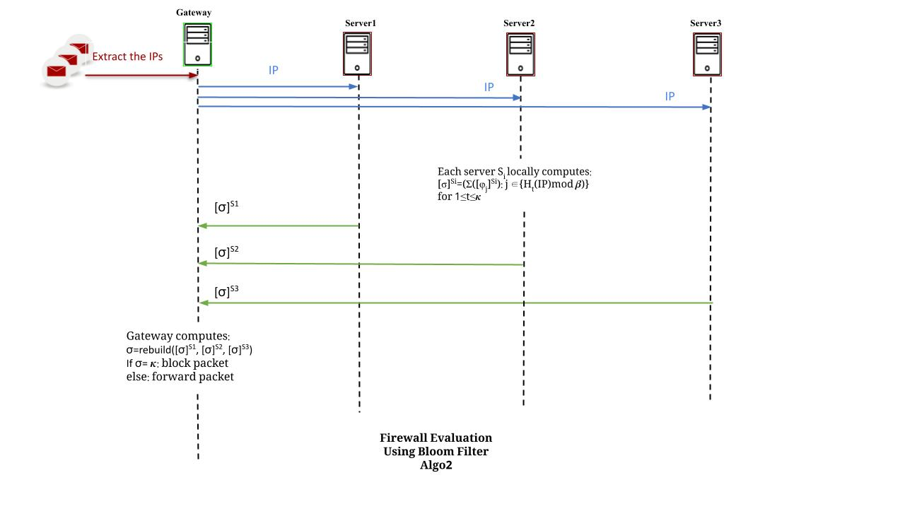
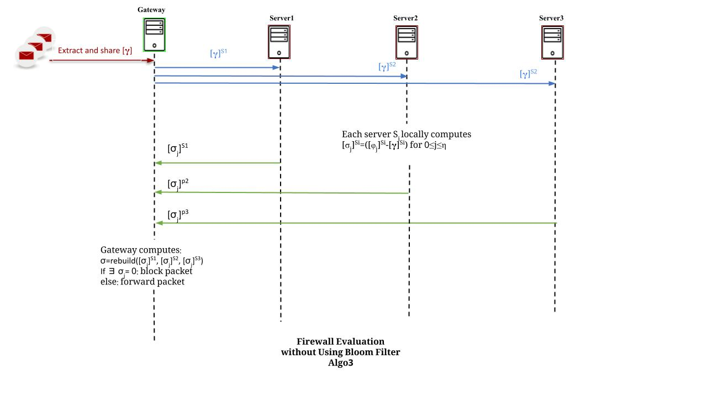
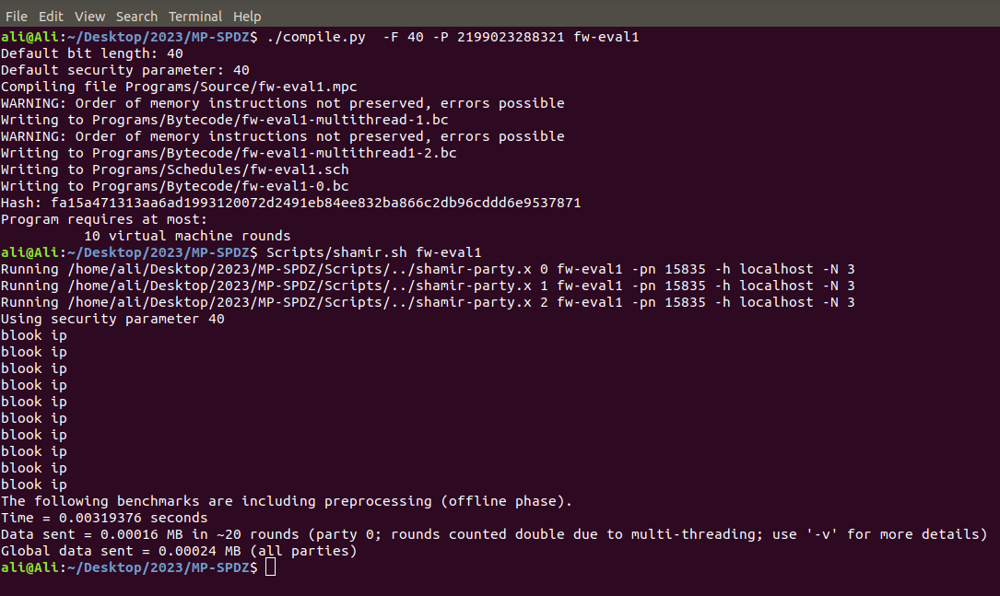
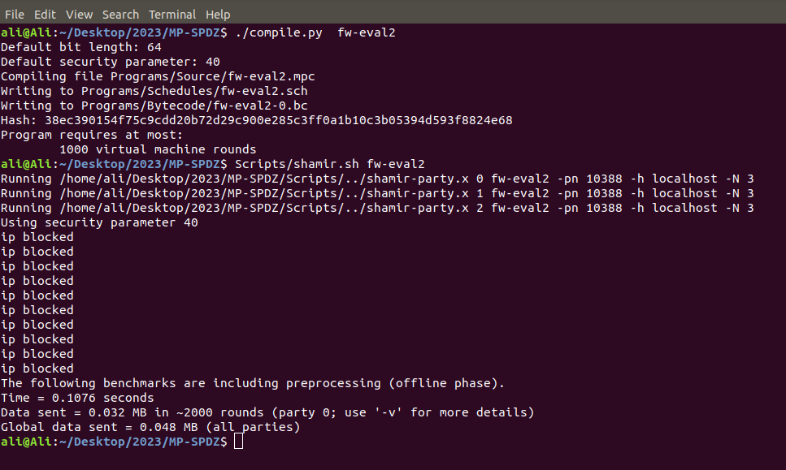

# SFW

This code is designed based on Oblivious IPtable paper for Secure Firewall implemntation.

The code implements three protocols and only meant for simulation to benchmark the overhead time and communication cost.
# System overivew



Figure 1: Oblivious Firewalls



Figure 2: Firewall Initialization
Algo1




Figure 3: Firewall Evaluation
Using Bloom Filter
Algo2




Figure 4: Firewall Evaluation
without Using Bloom Filter
Algo3


## Installation

To install the code follow the instructions
```
1- Install the MPSPDZ library at https://github.com/data61/MP-SPDZ.
2- mv fw-init.mpc fw-eval1.mpc fw-eval2.mpc MP-SPDZ/Programs/Source
```

## Usage
This is only used to benchmark initialization and evaluation protocols as follows:

### Initialization protocol 1
We have developed a lightweight initialization protocol that is used to initialize the iptable in a bloom filter. The gateway server is responsible for running this step. 

Input:

p=prime modulo which is set to 2199023288321

B=the size of the bloom filter, here we set it to 1400000 just for ease of test. The B value should be set to 14000000 to guarantee a small FP rate.

n= ip list size

k= number of hash functions

a and b=two random values in the field/ring which are fixed through all the protocols for the k hashes and used to facilitate the hash function. 

1- To compile the code run:

    ./compile.py -F 40 -P 2199023288321 fw-init
2- To run the code for Shamir's secret sharing scheme locally use:

    Scripts/shamir.sh fw-init

At the end of the protocol, the clear BF is stored in BF.text file under the MPSPDZ main directory.

To run on different machines, follow the instructions:

1- Set the IP addresses in a MPSPDZ/HOST.txt file 

2- For the Shamir scheme run for machines 0, 1, and 3 consecutively:

    ./shamir-party.x 0 fw-init -ip HOSTS -N 3
    ./shamir-party.x 1 fw-init -ip HOSTS -N 3
    ./shamir-party.x 2 fw-init -ip HOSTS -N 3

### Evaluation protocol 2, using BloomFilter

1- To compile the code run: 
    
    ./compile.py -F 40 -P 2199023288321 fw-eval1
2- To run the code for Shamir's secret sharing scheme locally use the following:

    Scripts/shamir.sh fw-eval1



Figure 5: Demo of Firewall Evaluation
without Using Bloom Filter
Algo3


To run on different machines, follow the instructions:

1- Set the IP addresses in a MPSPDZ/HOST.txt file 

2- For the Shamir scheme run for machines 0, 1, and 3 consecutively:

    ./shamir-party.x 1 fw-eval1 -ip HOSTS -N 3
    ./shamir-party.x 0 fw-eval1 -ip HOSTS -N 3
    ./shamir-party.x 2 fw-eval1 -ip HOSTS -N 3

At the end of the protocol, the list of IPs is blocked.
To see how the evaluation acts on a different iplist you can change the iplist passed to the algo2 function. 

### Evaluation protocol 3, without BloomFilter

1- To compile the code run: 
    
    ./compile.py fw-eval2
2- To run the code for Shamir's secret sharing scheme locally using:

    Scripts/shamir.sh fw-eval2



Figure 6: Demo of Firewall Evaluation
without Using Bloom Filter
Algo3


To run on different machines, follow the instructions:

1- Set the IP addresses in a MPSPDZ/HOST.txt file 

2- For the Shamir scheme run for machines 0, 1, and 3 consecutively:

    ./shamir-party.x 1 fw-eval2 -ip HOSTS -N 3
    ./shamir-party.x 0 fw-eval2 -ip HOSTS -N 3
    ./shamir-party.x 2 fw-eval2 -ip HOSTS -N 3


